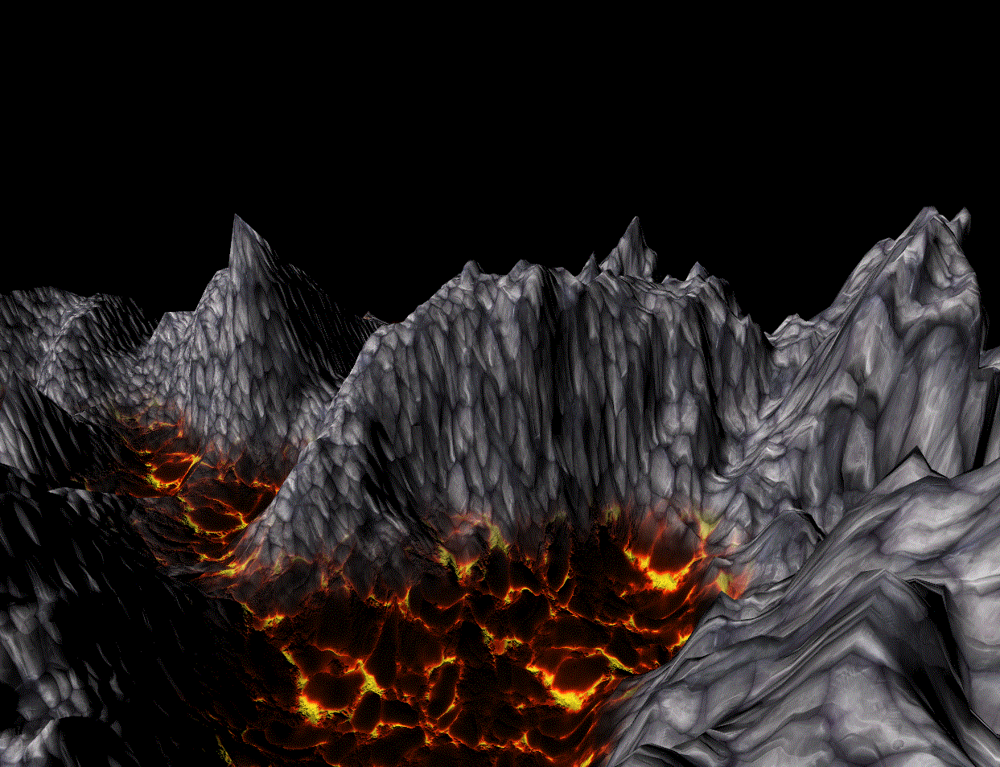
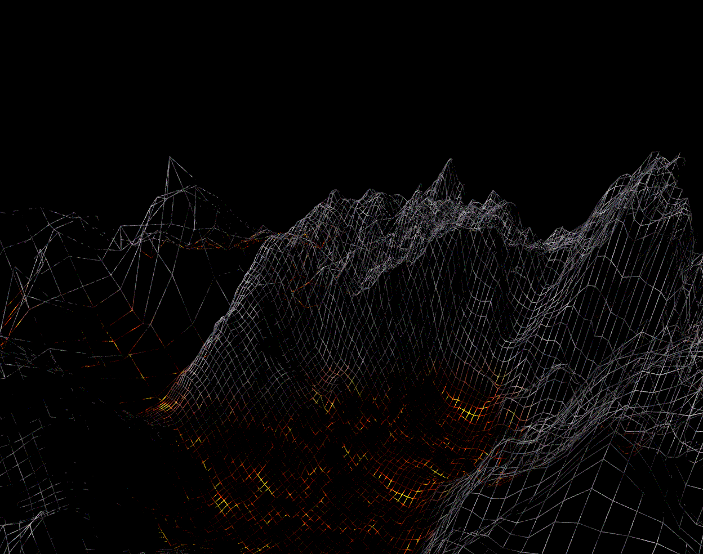
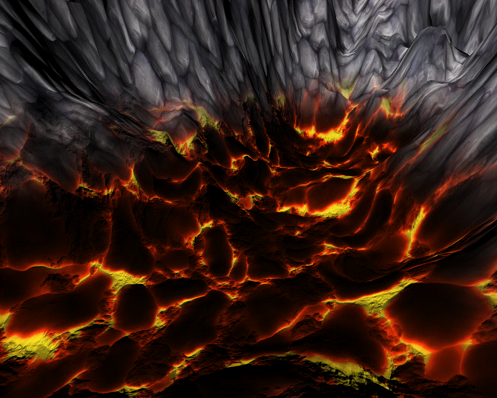

<div align="center">

# HeightMap — Real-Time 3D Terrain Renderer

**OpenGL terrain renderer in C with chunked LOD, multi-layer texturing, and tangent-space normal mapping.**




</div>

---

## Overview

A first-person 3D terrain renderer built from scratch in **C + OpenGL 3.3**, written for a Computer Graphics course at RAF. The terrain mesh is generated at runtime from a grayscale heightmap image — each pixel's intensity becomes a vertex elevation — and rendered with per-fragment Lambertian lighting, height-based texture blending, and tangent-space normal mapping.

The scene is split into four spatial **chunks** with two precomputed LOD levels; the renderer selects high- or low-resolution meshes per chunk based on camera distance, keeping triangle count low at range.

## Features

- **Procedural terrain mesh** generated from any grayscale heightmap (`res/images/heightmap.jpg`)
- **Chunked Level of Detail (LOD)** — 4 chunks × 2 densities, picked per-frame by camera distance
- **Height-based multi-layer texturing** — lava in valleys, rock on peaks, smooth `smoothstep` blend between them
- **Tangent-space normal mapping** with per-face TBN computed on mesh build — no lighting/polygon trade-off
- **Lambertian diffuse lighting** in the fragment shader
- **Free-fly camera** with mouse look and WASD/Space/Shift movement
- **Runtime toggles** — wireframe mode, chunking on/off, vertex density, Y-scale

## Demo

<table>
  <tr>
    <td align="center"><br/><sub>Full render — rock + lava layers with normal mapping</sub></td>
    <td align="center"><br/><sub>Wireframe — visible chunk density and LOD</sub></td>
  </tr>
  <tr>
    <td align="center" colspan="2"><br/><sub>Close-up — normal-map surface detail without added geometry</sub></td>
  </tr>
</table>

## Tech Stack

| Layer       | Used                                                         |
|-------------|--------------------------------------------------------------|
| Language    | C (C99)                                                       |
| Graphics    | OpenGL 3.3 core profile                                       |
| Windowing   | GLFW 3                                                        |
| Loader      | GLAD                                                          |
| Images      | `stb_image`                                                   |
| Framework   | RAFGL (course framework — window, input, texture/mesh helpers) |
| Shaders     | GLSL 330                                                      |

## Implementation Highlights

### 1. Terrain mesh from heightmap
Each pixel `(x, y)` of the heightmap becomes a vertex at `(x·scaleXZ, r/255·scaleY, y·scaleXZ)`; adjacent pixels are stitched into two triangles per grid cell. Index buffer lets us vary density by striding `res_const` cells per step. See [`src/main_state.c:158`](src/main_state.c) (`build_terrain_from_heightmapPart`).

### 2. Chunked LOD
On startup, the heightmap is split into a 2×2 grid of overlapping chunks. Each chunk is built twice — once at full density (`res_const = 1`) and once sparse (`res_const = 7`). At render time, for every chunk, the 2D distance from camera to chunk center decides which VAO to draw:

```c
if (rafgl_distance2D(cam.x, cam.z, chunk.center.x, chunk.center.z) > 10.0f)
    draw_low_res(chunk);
else
    draw_full_res(chunk);
```

### 3. Tangent-space normal mapping
During mesh build, per-triangle TBN vectors are computed from UV gradients and accumulated into each vertex, then normalized (Gram-Schmidt-free averaging). The vertex shader transforms T, B, N into world space and hands a `mat3 TBN` to the fragment shader, which samples the normal map, reconstructs a world-space normal, and uses it for Lambert shading — high-frequency detail without extra polygons.

### 4. Height-based texture blending (GLSL)
```glsl
float t = smoothstep(minHeight, maxHeight, pass_height);
vec4  color  = mix(lavaColor,  rockColor,  t);
vec3  normal = mix(lavaNormal, rockNormal, t);
```
Both the albedo *and* the normal map are blended by the same weight, so the surface transitions look coherent — lava's bumpy crust dissolves into rock's chipped profile across the elevation band. Full shader: [`res/shaders/second_shader/frag.glsl`](res/shaders/second_shader/frag.glsl).

## Build & Run

### Linux / macOS
```bash
sudo apt-get install libglfw3-dev   # or: brew install glfw
make
```
Runs `main.out` after build. (See `LinuxManual.txt`.)

### Windows
Open `RAFGL.cbp` in **Code::Blocks** (MinGW) — the project ships with `libs/glfw/glfw3.dll` and import libraries pre-wired. Build & run from the IDE. Make sure `glfw3.dll` sits next to the produced `.exe`.

## Controls

| Key              | Action                                                           |
|------------------|------------------------------------------------------------------|
| `W` `A` `S` `D`  | Move camera                                                      |
| `Space` / `Shift`| Fly up / down                                                    |
| `LMB` (hold)     | Mouse look                                                       |
| `Q` / `E`        | Decrease / increase Y-scale (when chunk split is **off**)        |
| `I` / `O`        | Low / original vertex density                                    |
| `R`              | Toggle wireframe                                                 |
| `P`              | Toggle chunk splitting & LOD                                     |
| `Esc`            | Quit                                                             |

## Project Structure

```
.
├── main.c                          # Entry — boots RAFGL and registers main_state
├── src/
│   ├── main_state.c                # Terrain gen, LOD, camera, render loop
│   └── glad/glad.c
├── include/                        # RAFGL, GLFW, GLAD, KHR, stb_image
├── res/
│   ├── images/                     # heightmap + rock/lava albedo & normal maps
│   └── shaders/second_shader/      # Terrain vertex + fragment shader
├── libs/glfw/                      # Windows GLFW binaries
├── screenshots/                    # README assets
├── Makefile                        # Linux/macOS build
└── RAFGL.cbp                       # Code::Blocks project (Windows build)
```

## References

- Terrain rendering approach — [blogs.igalia.com — OpenGL Terrain Renderer](https://blogs.igalia.com/itoral/2016/10/13/opengl-terrain-renderer-rendering-the-terrain-mesh/)
- Multi-layer heightmap texturing — [mbsoftworks.sk Tutorial 018](https://www.mbsoftworks.sk/tutorials/opengl4/018-heightmap-pt3-multiple-layers/)
- Tangent-space normal mapping — [LearnOpenGL — Normal Mapping](https://learnopengl.com/Advanced-Lighting/Normal-Mapping)
- Heightmap generator — [manticorp.github.io/unrealheightmap](https://manticorp.github.io/unrealheightmap/)
- PBR textures — [3dtextures.me](https://3dtextures.me)

---

<details>
<summary>🇷🇸 <b>Srpski — kratak opis</b></summary>

Height mapa se učitava sa slike i intenzitet piksela (r kanal) određuje visinu svakog vertexa. Teren je podeljen u **chunk-ove** radi lakše implementacije **LOD-a** — za svaki chunk se na startu generišu dve mreže različite gustine, i prikazuje se odgovarajuća u zavisnosti od udaljenosti kamere (2D `dxz` razdaljina). Teksturiranje koristi tri nivoa po visini (lava → interpolacija → kamen); na isti način se interpoliraju i normal mape koje dodaju detalje bez povećanja broja poligona. Osvetljenje je Lambertov difuzni model.

</details>

---

<div align="center">

Built with ❤️ as a final project for the **3D Computer Graphics** course @ RAF.

</div>
